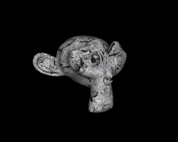
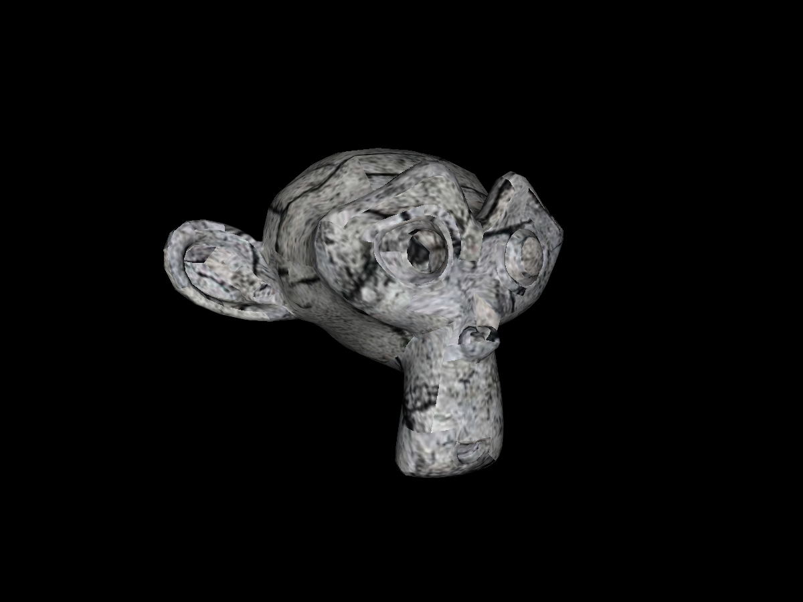
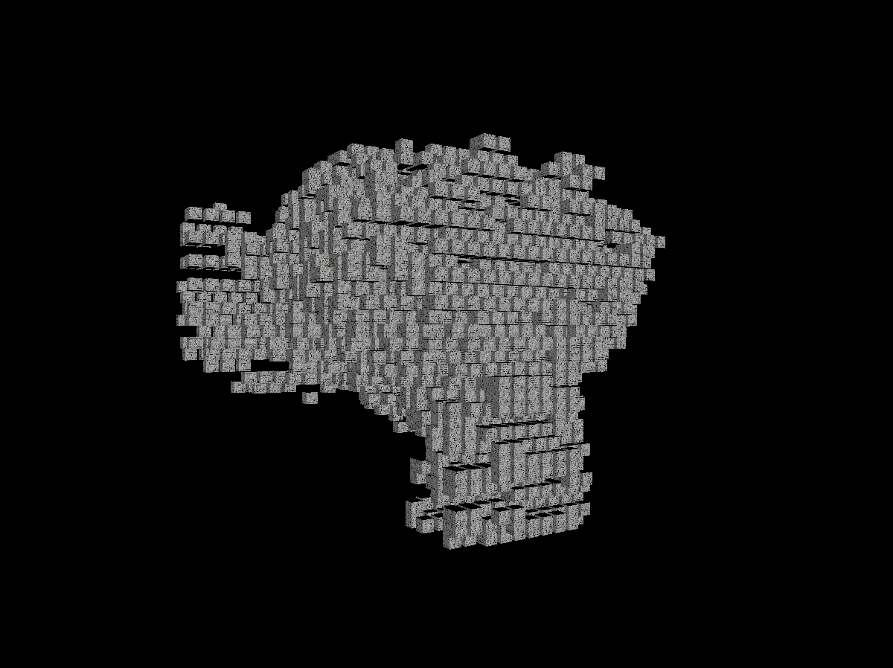
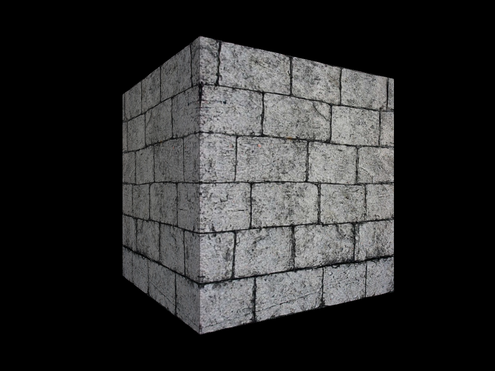
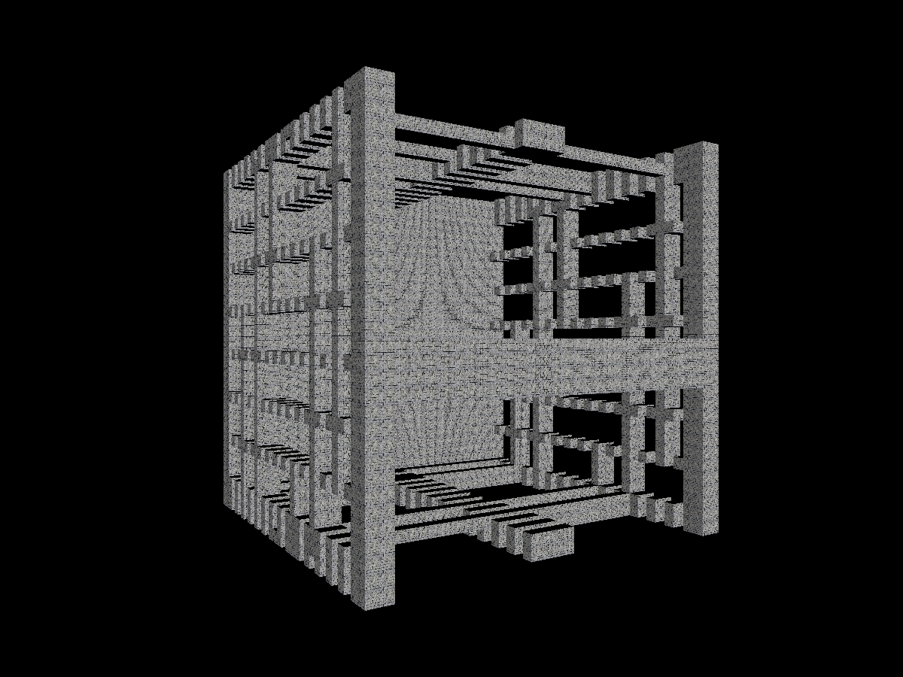

# CUDA SDF Calculation

Developed by *Aleksei Grandilevskii* (aka *zer0deck*) in 2024.

## Project Description

This program allows you to calculate **Sign distance functions** in 3D-space using CUDA kernels.



## How to run

Flag `log=1` for logging in the console. Default is `log=0`.

```shell
$ make all log=1 ARGS="-f ./myfile.obj"
```

>You can compile and build 3 different versions. In addition to the standard compilation, there are debug and test builds for use. For a test build use:
>```shell
>$ make all log=1 t=1
>```
>For debug build use:
>```shell
>$ make all log=1 dbg=1
>```
>Test build will process a simple cube mesh, and debug will process monkey.

## Arguments

|argument|input_example|default_value|meaning|
|---|---|---|---|
|`-f`|`-f ./data/meshes/test.Mesh.obj`|-|Allows you to process your own file.|
|`-v`|`-v 64`|`32`|Set SDF resolution (based on CUDA dimensions, so should be 8 multiple).|
|`-d`|`-d 0.05`|`0.01`|Set SDF visualization depth (how close should be block to be visualized).|
|`-r`|`-r 1`|`0`|Bool. Enable/disable visualisation rotation.|

## Example

|INPUT|OUTPUT|
|---|---|
|||
|||
	
## Code organization

`src/` This folder contains source code .cu and .h files;

`lib/` This folder contains additional includes;

`data/` This folder is used by application as default place of data input/output;

`bin/` This folder contains precompiled example with sha256 checksum. Program is compiled here as the default.

`.debug/` This folder contains results of debug build execution to look at.

## Requirements

> no specific requirements as long OpenGL is supported by every PC core.